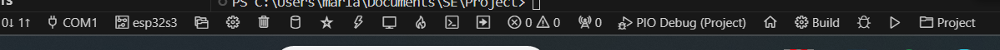

# Compilar para simulador



1. Compilar o codigo com a extensão `ESP-IDF` - Cilindro 
    ou no terminal com ```idf.py build```

2. Abrir o terminal da extensão 5 icones a frente do cilindro 

    2.1 ``idf.py uf2``Linking o nosso source code com o bootloader para correr no simulador

> __NOTA__: Nos setting da extensão existe uma variavel que é ``idf.postbuild`` e que deve passar a ter a linha de codigo ```idf.py uf2``` para fazer o linking automático a seguir a dar build

> Tb é crucial o ```Full boot``` attribute on the JSON diagram
