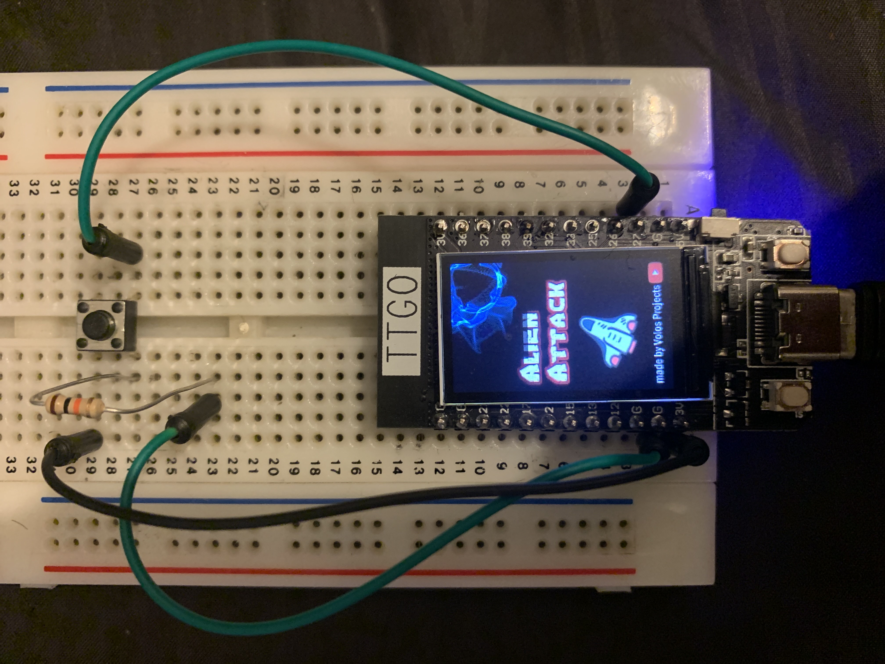
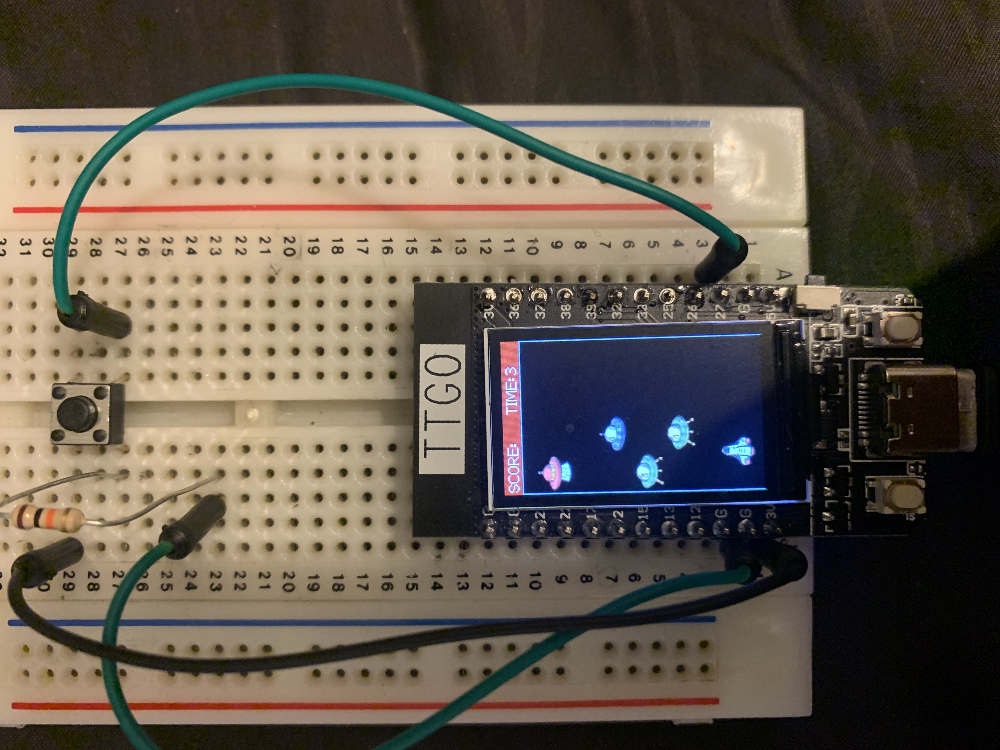

---
title:  'Game Player with Wifi controlller'
shorttitle: 'Esp 32 Game Console'
author:
- name: Martinho Figueiredo
  email: up201506179@fe.up.pt
- name: Túlio Soares
  email: upup201800165@fe.up.pt
institute: Faculdade de Engenharia, Universidade do Porto
keyword:
  - ESP32
  - RTOS
lineno: false
abbreviation:
  - RTOS, real time operationg system
abstract: |
  In this project we will create and evaluate a small game controller and display based on a ESP32 Microcontroller
bibliography: references.bib
template: scientific_reports
documentclass_options: 
  - final
...

# Introduction
 The system we developed is intend to be used as a small digital clock with a few minigames. This serves as an example of a IoT device capable of displaying some up to date information like the weather and having some interative features that need a realtime response as for the minigames.

# Methods

We tried to structure the code for the functions we wanted to develop in a "apps" a  class object that has a `setup` method that handles all the configuration of the microcontroller and a `routine` method that has to be iterated on to update the app.

The timing of each function was done using the `micro()` to timestamp the begin and end of the function and the value presented here was calculated as the last result of a rolling average after 10000 cycles.

The memory usage of our programs takes into account the assets needed to run the applications and the binary that compiled and uploaded  

# Apps

# Clock and Weather

 
- This app 

# Games

## Alien Attack
- This game uses two buttons to move a spaceship side ways on the screen in order to hit enemys.

## Bounce Ball
- This game uses two buttons to move platform side ways on the screen in order to catch and return the ball to break the block on the top of the screen.

## Results

| App             | Flash (MAX 1310720 bytes) | RAM (MAX 327680 bytes) | Run Time (Avg) |
|:---------------:|:-------------------------:|:----------------------:|:--------------:|
| Clock & Weather | 1274853 bytes (97.3%)     | 43488 bytes (13.3%)    |                |
| Alien Attack    |                           |                        |                |
| Bounce Ball     |                           |                        |                |
|                 |                           |                        |                |
|                 |                           |                        |                |

Footnotes can be entered using this code.

Figures are included like this.

<!--{#fig:dummy width=40% height=20%}

And referenced from here as Fig. @fig:dummy.
-->
Complex tables can use standard LaTeX code as this one.

<!---
Table in LaTeX format because of fancy formatting
-->

# Results

Lorem ipsum dolor sit amet, consectetur adipiscing elit, sed do eiusmod tempor 

# Discussion

Lorem ipsum dolor sit amet, consectetur adipiscing elit, sed do eiusmod tempor 
# References