<!-- Global style -->

# Applying Android OS to real-time applications​

> José Pedro Cruz
> Mariana Dias
> Martinho Figueiredo

<!--Good [morning/afternoon/evening], everyone. Thank you for being here today. My name is [Your Name], and I am delighted to welcome you to this seminar on "Applying Android OS to Real-Time Applications."-->

---
# Importance of Real-Time in Embedded Systems

In the realm of embedded systems, especially in applications like automotive, robotics, and industrial systems, real-time performance is crucial. These applications demand timely responses within pre-specified constraints. This is where real-time operating systems (RTOS) come into play.
- Android has become ubiquotous as good UX-UI OS, so it would be beneficial to try and use those features while being able to perform under strict, real time conditions.  

---
# Aim of the Research

<!--The primary objective of our research was to evaluate Android's real-time behavior and performance. We conducted a series of tests, including-->

The primary objective of our research was to evaluate Android's real-time behavior and performance. For that we are insterested in:

 - **thread switch latency** - how long does it take to switch context
 - **interrupt latency** - how long it takes for a HW Interrupt to be detected in SW
 - **sustained interrupt frequency** - what is the minimum time between interrupts
 - **semaphore/mutex behavior** - does android have shared resources controllers? 

These tests are fundamental in understanding Android's real-time capabilities.

---
# Android Architecture 
Android is a Application Software Platform. Android is not just another operating system.
- It's a versatile open-source platform developed by Google for mobile and embedded systems. It provides a robust framework for application development, supporting Java and C/C++ languages.

---
# Android Runtime
- Because of it's target use case, it is optimized for fast __response times__ and __low memory footprint__.
- It uses the  __Dalvik Virtual Machine__ (DVM) with register based bytecode
- Designed to have one private instance per application
- Build with `Bionic`, Google's version of `libc`
    - It includes a very fast and small implementation of `pthread`
---

# Experimental Setup

- [Linaro Android Beagle](https://android-build.linaro.org/) release 11.09 
    - Android version 2.3.5
        - Based on Linux 3.0.4
- Running on an ARM platform ([BeagleBoard-XM](https://www.beagleboard.org/boards/beagleboard-xm))  wih the following specs:
    - Texas Instruments DM3730 Digital Media Processor
    - ARM Cortex A8 processor running at 1GHz 
    - L1 instruction and data caches are 32KB each
    - L2 cache is 64KB
    - 512MB of RAM @ 166MHz
    
---

# Methodology

- We will use the internal General Purpose Timer (__GPT__) running at 13 MHz, to measure the absolute time, at different stages of the tests. Since the test software needs this timer, it needs to be mapped into user space. The measurements are held in RAM during execution then stored to memory and analyzed. 
- The real-time run-away protecion of the kernel is also disabled.
    - `/prc/sys/kernle/sched_rt_runtime_us` to `-1`
---

# Calibration

In order to put the results into context, 2 calibration tests are run to make sure of the validity of the results

## Tracing Overhead

- The minimum resolution for the system is the period of the timer $\frac{1}{13\ MHz} = 0.1 \micro s$, therefore the results are all rounded to 0.1 µs

---

## Clock tick Processing Duration

- Since the `Busy loop` can only be delayed by an interrupt handler and we remove all other interrupts only the consistency of the timer tick is noticed here 

---

# Tests
## Thread Switch Latency
## Interrupt Latency
## Sustained Interrupt Frequency
## Semaphore/mutex Behavior
---
## Thread Switch Latency

- The time between `t1` of the $n$ task and `t0` of the task $n+1$

---
## Interrupt Latency

- The time after the thread stops running until the first instruction of the interrupt (only measures SW delay)
---
## Sustained Interrupt Frequency

- Optimistic worst case scenario, but gives us a lower boundary for the period between interrupts. 
---
## Semaphore/mutex Behavior

### Priority Inversion
---
# Research Findings

Our experimental measurements provided valuable insights. We discovered specific limitations in Android's real-time capabilities, especially concerning thread and interrupt handling. These limitations are critical for applications where meeting deadlines is paramount.

---
# Challenges and Limitations

During our research, we encountered several challenges, both technical and methodological. Additionally, Android's limitations in real-time applications, particularly in the Bionic C library, became apparent. These constraints impact Android's ability to function effectively in real-time environments.

---
# Possible Solutions

While we identified challenges, we also explored potential solutions. Enhancements in the Bionic C library and other Android components could significantly improve its real-time capabilities. We encourage discussions and brainstorming for more innovative solutions.

---
# Conclusion

In conclusion, our research indicates that while Android is a powerful and adaptable platform, it falls short in meeting the stringent requirements of real-time applications. However, with extensive enhancements and collaborative efforts, there's potential for Android to excel in these critical environments.

---
# Q&A

Thank you for your attention. I now invite questions from the audience. Please feel free to ask any queries or share your thoughts on this topic